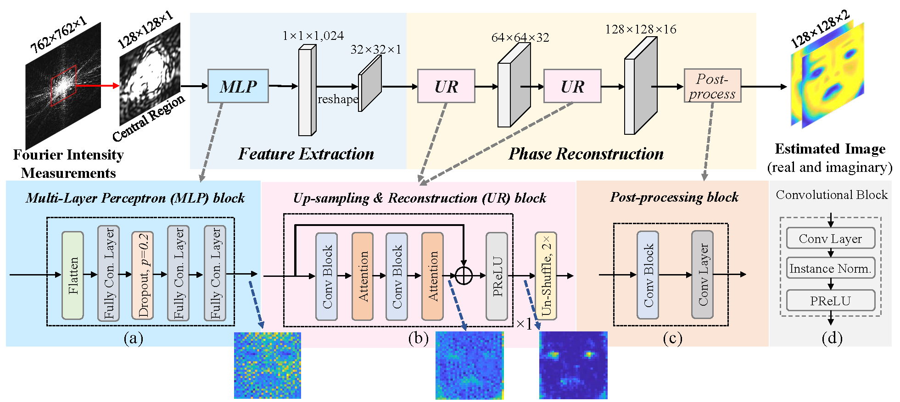

# SiSPRNet: End-to-End Learning for Single-Shot Phase Retrieval
#### Authors: Qiuliang Ye, Li-Wen Wang, Daniel P. K. Lun




This repository contains models trained by PyTorch. If you find this work useful in your research, please cite:
```
@ARTICLE{Ye_SiSPRNet,
author = {Qiuliang Ye and Li-Wen Wang and Daniel P. K. Lun},
journal = {Opt. Express},
number = {18},
pages = {31937--31958},
publisher = {Optica Publishing Group},
title = {{SiSPRNet}: end-to-end learning for single-shot phase retrieval},
volume = {30},
month = {Aug},
year = {2022},
doi = {10.1364/OE.464086},
  }
```


## Prerequisites
The `requirements.txt` file should list all Python libraries that your notebooks depend on, and they will be installed using:
```bash
pip install -r requirements.txt
```

## Running
- A experimental testing images are included in the `Data` folder.
- The trained model for the RAF & Fashion-MNIST dataset can be found in the release: https://github.com/Qiustander/SiPRNet/releases/tag/SiPRNet. Please download them and place in the `Model` folder.
- Test the model:
```bash
python Save_result_SiPRNet.py
```
The test results will be saved to the folder: `./Result`.

#### Please change `dataset_name` (RAF/Fashion) in the `Save_result_SiPRNet.py` to generate the results with specific datasets.


## Result


